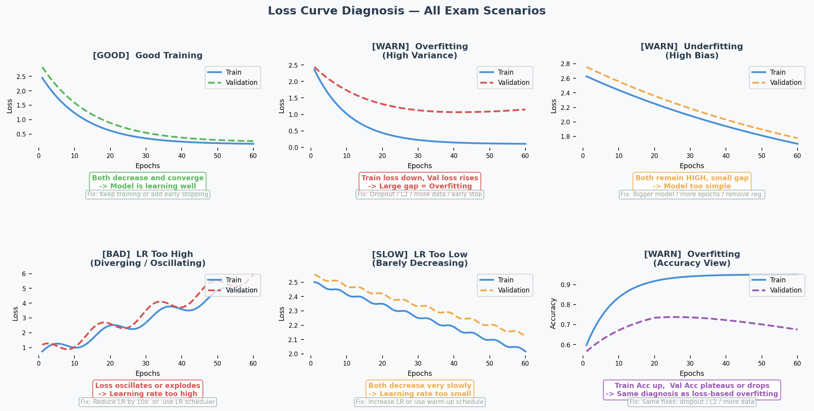

# Bias-Variance Tradeoff & Design Choices

## Exam Importance
**MUST** | The single most tested topic: 4 questions across all exams, ~20 marks total

---

## Feynman Draft

Imagine you're learning to throw darts at a bullseye.

- **High bias（高偏差）** = you consistently miss in the same direction. Your aim is systematically off. You're too rigid — like using only your wrist instead of your whole arm. This is **underfitting（欠拟合）** — your model is too simple to capture the real pattern.

- **High variance（高方差）** = your throws are scattered all over the board. Sometimes you hit the bullseye, sometimes the wall. You're too sensitive to tiny movements. This is **overfitting（过拟合）** — your model memorises the training data noise instead of learning the real pattern.

**How do you diagnose this from training curves?**

| What You See | Diagnosis | Name |
|---|---|---|
| Training accuracy HIGH, Validation accuracy LOW | High variance | **Overfitting** |
| Training accuracy LOW, Validation accuracy LOW | High bias | **Underfitting** |
| Training accuracy HIGH, Validation accuracy HIGH | Good fit! | Keep it |

**Toy Example with Numbers:**

| Scenario | Train Acc | Val Acc | Diagnosis | What to Do |
|---|---|---|---|---|
| A | 95% | 60% | **Overfitting（过拟合）** | Regularisation, more data |
| B | 50% | 50% | **Underfitting（欠拟合）** | Bigger model, remove regularisation |
| C | 92% | 88% | **Good fit** | Ship it |

> Common Misconception: "If validation accuracy is low, always add regularisation." WRONG! Regularisation helps overfitting (A), but makes underfitting (B) even WORSE because it constrains the model further.

> Core Intuition: Bias（偏差） = model too simple for the problem. Variance（方差） = model too complex for the data amount.

---

## The Design Choices Decision Tree (EXAM ESSENTIAL)

This is the teacher's favourite question format. Memorise this:

```
Step 1: DIAGNOSE
  Train >> Val? → Overfitting (high variance)
  Train ≈ Val ≈ low? → Underfitting (high bias)

Step 2: PRESCRIBE
  If OVERFITTING（过拟合）:
    ✅ Regularisation（正则化） (L1, L2, Dropout) → constrains model complexity
    ✅ More/diverse training data → helps generalise（泛化）
    ✅ Data augmentation（数据增强） → more variety without new data
    ✅ Batch normalisation（批量归一化） → regularising effect
    ✅ Early stopping（提前停止） → stop before overfitting
    ✅ Reduce model size → less capacity to memorise
    ❌ More epochs → makes it WORSE
    ❌ Bigger model → makes it WORSE

  If UNDERFITTING（欠拟合）:
    ✅ Increase model size (more layers/neurons) → more capacity（容量）
    ✅ Train longer → give it time to learn
    ✅ Remove/reduce regularisation → stop constraining
    ✅ Better features / more data → more signal
    ✅ Transfer learning（迁移学习） → start from pretrained model
    ❌ Regularisation → makes it WORSE
    ❌ Dropout → makes it WORSE
    ❌ Smaller model → makes it WORSE
```

---

## Past Exam Questions with Answer Logic

### 2024 Q2 [6 marks] — Overfitting Scenario
**Setup:** 5 hidden layers, ReLU, 20 neurons/layer, 1000 epochs. Train=95%, Val=60%.

| Suggestion | Answer | Reasoning |
|---|---|---|
| Train for 2000 epochs | **NO** | Already overfitting → more training = memorise more noise |
| Larger dataset | **YES** | More diverse data helps learn general patterns, not noise |
| L2 regularisation | **YES** | Penalises large weights → simpler, more generalisable model |

### Practice Q3 [6 marks] — Underfitting Scenario
**Setup:** 2 hidden layers, ReLU, 5 neurons/layer, 2000 epochs, L1 regularisation. Train=50%, Val=50% (achievable=95%).

| Suggestion | Answer | Reasoning |
|---|---|---|
| Increase network size | **YES** | Underfitting = model too small → need more capacity |
| Initialise weights to 0 | **NO** | Creates symmetry → all neurons learn identical things → can't differentiate features |
| Use dropout | **NO** | Dropout is regularisation → fights overfitting, not underfitting |

### 2025 Q2 [3 marks] — Curve Interpretation
**Setup:** Training curves after 20 epochs showing gap between train/val accuracy and diverging loss curves.

**(a)** Diagnose: High variance (overfitting) — clear gap between training and validation. Possibly also high bias if training loss is still high.

**(b)** Two changes (each targeting different aspect):
- Regularisation (e.g., L2, dropout) → reduces overfitting
- Data augmentation → more varied training data → better generalisation
- Batch normalisation → has regularising effect
- Increase model size (if bias is high) → more capacity to fit

---

## How to Read Training Curves



**Quick reference table:**

| What you see on the plot | Diagnosis | Fix |
|---|---|---|
| Train loss ↓, Val loss ↑ after a point | **Overfitting（过拟合）** (high variance) | Dropout, L2, more data, early stop |
| Both losses stay HIGH | **Underfitting（欠拟合）** (high bias) | Bigger model, more epochs, less regularisation |
| Loss oscillates / explodes | **LR too high** | Reduce LR ×10, use scheduler |
| Both losses barely move | **LR too low** | Increase LR, use warm-up |
| Both losses ↓ and converge | **Good fit** | Keep going or early stop |

---

## English Expression Templates

**Diagnosing:**
- "The model displays high variance as there is a clear gap between training and validation accuracy."
- "This indicates overfitting, where the model fits the training data too closely but fails to generalise."

**Prescribing:**
- "Applying regularisation can help reduce overfitting by limiting model complexity."
- "Training on a larger dataset might help the model learn more general patterns."
- "This will not help because the model is already underfitting — adding regularisation would constrain it further."

---

## 中文思维 → 英文输出

| 你脑中的中文想法 | 考试中应该写的英文 |
|---|---|
| 过拟合了，训练高验证低 | "The model is overfitting — the training accuracy (X%) is significantly higher than the validation accuracy (Y%)." |
| 欠拟合，两个都很低 | "The model is underfitting, as both training and validation accuracies are low, indicating insufficient model capacity." |
| 加正则化能改善 | "Applying regularisation is likely to improve validation accuracy by constraining model complexity." |
| 不能再多训练了，会更差 | "Training for more epochs will not help — it is likely to worsen overfitting as the model continues to memorise training noise." |
| dropout不能解决欠拟合 | "Dropout will not help because the model is underfitting. Dropout reduces effective capacity, which would worsen the problem." |
| 模型太简单了，学不到东西 | "The model lacks sufficient capacity to capture the underlying patterns in the data." |
| 需要更多数据来泛化 | "Increasing the dataset size is likely to help the model generalise better by providing more diverse examples." |
| 权重初始化为0不行 | "Initialising all weights to zero creates symmetry — all neurons learn identical features, preventing the network from differentiating." |

### 本章 Chinglish 纠正

| Chinglish (avoid) | Correct English |
|---|---|
| "The model is overfit" | "The model is overfitting" (use progressive form for the state) |
| "It should add regularisation" | "Applying regularisation would help" |
| "The gap is too big" | "There is a significant discrepancy between training and validation performance" |
| "More data can solve" | "Increasing the dataset size is likely to help the model generalise better" |
| "The model is not enough complex" | "The model has insufficient capacity" |
| "Train more epoch will be worse" | "Training for more epochs is likely to worsen overfitting" |

---

## Whiteboard Self-Test
- [ ] Can you draw the bias-variance diagnosis table from memory?
- [ ] Given train=95%/val=55%, what's the diagnosis? What 3 things help?
- [ ] Given train=50%/val=50%, what's the diagnosis? Why does dropout NOT help?
- [ ] Can you explain why zero weight initialisation is bad?
- [ ] Can you explain why more epochs worsens overfitting?
