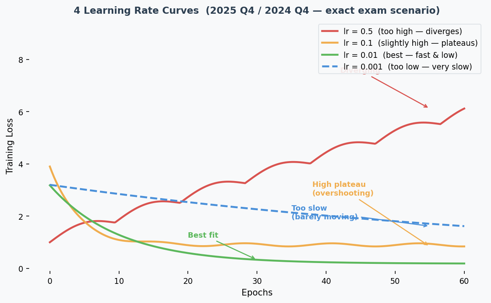
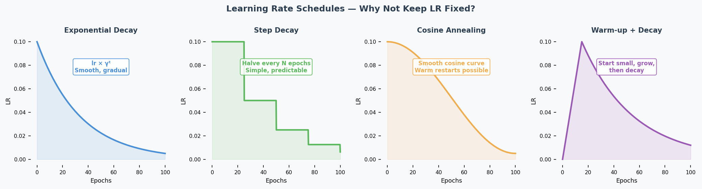
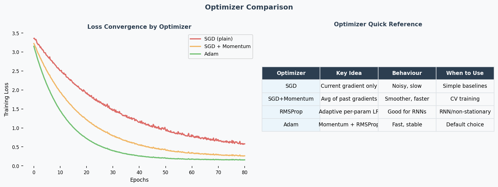

# Optimization: Learning Rate, Schedules & Optimizers

## Exam Importance
**HIGH** | 2 out of 3 exams (2025 Q4, 2024 Q4) — 8 marks total

---

## Feynman Draft

Imagine you're blindfolded on a hilly landscape, trying to find the lowest valley. You take steps downhill based on the slope you feel under your feet. That's **Gradient Descent**（梯度下降）.

The **learning rate**（学习率） is your step size:
- **Too big** (0.5): You leap so far you jump OVER the valley and end up on the other side, maybe even higher. Your loss goes UP. This is **divergence（发散）**.
- **Too small** (0.001): You take tiny baby steps. You'll eventually get there, but it takes forever. This is **slow convergence（收敛缓慢）**.
- **Just right** (0.01): You stride confidently into the valley. Fast **convergence（收敛）** to low loss.
- **Slightly too big** (0.1): You get near the valley but keep **overshooting（超调）** back and forth, settling at a suboptimal point.

**The 4 Loss Curves — This Exact Question Was on 2025 AND 2024:**

| Curve | Shape | Learning Rate | Why |
|-------|-------|--------------|-----|
| Red (solid) | Loss goes UP / oscillates | **0.5** (highest) | Steps too large → jumps over optimum repeatedly |
| Orange (solid) | Fast drop but plateaus HIGH | **0.1** | Overshoots, settles at suboptimal point |
| Green (solid) | Fast drop to LOWEST loss | **0.01** | Sweet spot — fast convergence to good minimum |
| Blue (dashed) | Very slow descent | **0.001** (lowest) | Tiny steps → barely moves |

> Common Misconception: "Curve 2 could be lr=0.001 because it gets stuck." While small lr CAN get stuck in local minima, the teacher's intended answer is: converging to a high loss = lr slightly too high (overshooting), not too low. Match the explanation consistently to the other curves.

> Core Intuition: Learning rate controls step size — too big overshoots, too small is slow, just right converges fast to a good minimum.

---

## Learning Rate Schedules（学习率调度） (2024 Q4.1)

**What:** Change the learning rate during training instead of keeping it fixed.

**Why:** Start with large steps (explore quickly), then shrink steps (fine-tune near optimum（最优点）).

| Schedule | How It Works | Benefit |
|----------|-------------|---------|
| **Exponential decay（指数衰减）** | $lr_t = lr_0 \times \gamma^t$ | Smooth, gradual decrease |
| **Step decay（阶梯衰减）** | Halve lr every N epochs | Simple, predictable |
| **Cosine annealing（余弦退火）** | lr follows cosine curve | Warm restarts possible |
| **Warmup（预热）** | Start small, increase, then decrease | Avoids early instability |

**Exam answer (1 example is enough):** "Exponential learning rate decay reduces the lr as training progresses. This is beneficial because it allows taking large steps initially to move quickly towards an optimum, then smaller steps to avoid overshooting it."

---

## Momentum（动量） (2024 Q4.2)

**Analogy:** Imagine pushing a ball downhill. Without momentum, the ball moves exactly where the current slope points — every tiny bump changes its direction. With momentum, the ball builds up speed and rolls smoothly past small bumps, heading in the general downhill direction.

**Mechanism:** Instead of updating weights（权重） using ONLY the current gradient（梯度）, momentum keeps a running average of past gradients:

$$v_t = \beta \cdot v_{t-1} + (1-\beta) \cdot \nabla L$$
$$w = w - lr \cdot v_t$$

Where $\beta$ (typically 0.9) controls how much past gradients matter.

**Effects:**
1. **Smooths updates:** Averages out noisy gradients → more stable direction
2. **Accelerates convergence（加速收敛）:** Builds up speed in consistent downhill directions
3. **Escapes shallow local minima（局部最小值）:** Momentum carries the ball through small bumps

---

## Key Optimizers Quick Reference

| Optimizer | Mechanism | When to Use |
|-----------|-----------|-------------|
| **SGD（随机梯度下降）** | Fixed learning rate, uniform for all parameters | Baseline; simple problems; when you want full control |
| **SGD + Momentum（动量）** | Accumulates past gradients (velocity term), smooths updates | Noisy gradients; saddle points（鞍点）; most standard training |
| **RMSProp** | Adapts lr **per-parameter** using running average of squared gradients — divides by √(avg of grad²) | Non-stationary problems; RNNs; uneven gradient scales |
| **Adam** | Combines momentum (1st moment) + RMSProp (2nd moment) — adaptive（自适应） lr with momentum smoothing | **Best default choice**; fast convergence; works well out-of-the-box for most tasks |

**Why Adam is the go-to optimizer (2024 Q7 — "better optimisers"):**
Adam adapts the learning rate for each parameter individually. Parameters with large gradients get smaller steps; parameters with small gradients get larger steps. This is especially helpful for deep networks where gradient magnitudes vary wildly across layers — it directly mitigates the vanishing/exploding gradient problem（梯度消失/梯度爆炸） at the optimiser level.

**When SGD still wins:**
For very large-scale training (e.g., ImageNet), well-tuned SGD + momentum + lr schedule can generalise better than Adam. Adam sometimes converges to sharper minima, while SGD finds flatter (more generalisable) minima.

---

## Past Exam Questions

**2025 Q4 [4m]:** Match 4 loss curves to learning rates 0.5, 0.1, 0.01, 0.001. Justify each.
**2024 Q4 [4m]:** (1) Give LR schedule example + why beneficial. (2) Explain momentum.

---

## 中文思维 → 英文输出

| 你脑中的中文想法 | 考试中应该写的英文 |
|---|---|
| loss在震荡上升，学习率太大 | "The loss curve diverges, indicating the learning rate is too high — the gradient updates overshoot the minimum." |
| loss下降很慢 | "The loss decreases very slowly, suggesting the learning rate is too small." |
| 学习率衰减好处 | "A learning rate schedule allows fast initial convergence while enabling fine-tuning near the optimum." |
| 动量能平滑更新 | "Momentum smooths the optimisation trajectory by maintaining an exponentially decaying average of past gradients." |
| Adam是最好的默认选择 | "Adam is an effective default optimiser as it adapts the learning rate per parameter." |
| 曲线先降后升，过拟合了 | "The validation loss initially decreases then increases, indicating the onset of overfitting." |
| 这条曲线收敛到一个比较高的值 | "The loss converges to a suboptimal value, suggesting the learning rate is slightly too high, causing the updates to overshoot." |

### 本章 Chinglish 纠正

| Chinglish (avoid) | Correct English |
|---|---|
| "The learning rate is too much" | "The learning rate is too high" |
| "Loss is going up means overfitting" | "A diverging loss indicates the learning rate is too high, not overfitting" |
| "Adam is the best optimizer" | "Adam is generally an effective default choice" (hedge appropriately in academic writing) |
| "The curve is vibrating" | "The loss curve oscillates" |
| "Learning rate should be decay" | "A learning rate schedule should be applied" |
| "Momentum can help the speed" | "Momentum accelerates convergence by smoothing the gradient updates" |

---

## Whiteboard Self-Test
- [ ] Can you draw 4 loss curves for different learning rates and label each?
- [ ] Can you explain why a diverging loss curve means the lr is too high?
- [ ] Can you name one LR schedule and explain why it helps?
- [ ] Can you explain momentum in your own words (not just the formula)?
