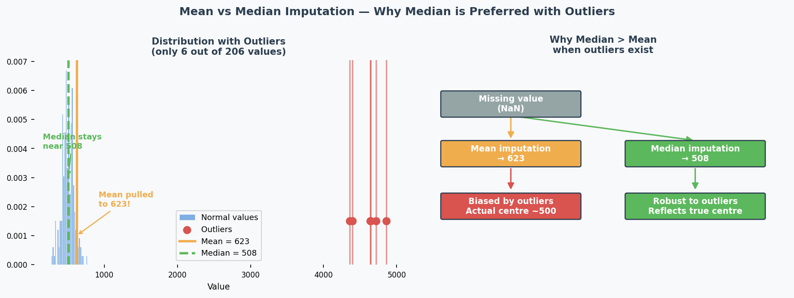

# Module A — Data Preprocessing

## Exam Importance
**MUST** | Every exam has a data preprocessing question (2025 Q1, 2024 Q1, Practice Q1)

---

## Feynman Draft

Imagine you're a chef and someone delivers raw ingredients to your kitchen. Some tomatoes are rotten (outliers), some boxes are missing labels (missing values), some ingredients are measured in grams while others are in kilograms (different scales). You can't cook with this mess — you need to clean and prepare everything first. That's data preprocessing.

**The 4 things you might need to do:**

1. **Missing Values（缺失值）** — Some cells in your spreadsheet are empty
   - *Numerical data?* → Fill with **median** (robust to outliers) or mean — this is called **Imputation（插补/填补）**
   - *Categorical data?* → Fill with **most frequent value** (mode)
   - *Almost all missing?* → **Remove the entire column** (attribute)

2. **Outliers（异常值/离群值）** — Values that are absurdly far from the rest
   - Look at: is max/min way larger than mean + a few standard deviations?
   - Example: mean=500, std=100, but max=50000 → definitely outliers

3. **Scaling（缩放）** — Features on different scales confuse the model
   - **Standardisation（标准化）** (z-score): $ x' = (x - \mu) / \sigma $ → mean=0, std=1
   - Use when features have different units/ranges

4. **Encoding（编码）** — Models need numbers, not text
   - **One-hot encoding（独热编码）**: turn "Red/Blue/Green" into [1,0,0], [0,1,0], [0,0,1]
   - Use for categorical data with NO natural ordering

**Toy Example:** Dataset with 10,000 samples:

| Attribute | Type | Missing | Mean | Std | Max | Min |
|---|---|---|---|---|---|---|
| Attr 1 | Binary | 0 | / | / | / | / |
| Attr 2 | Numerical | 15 | 500 | 100 | 50000 | -1000 |
| Attr 3 | Categorical | 0 | / | / | / | / |
| Attr 4 | Numerical | 9995 | 1.2 | 0.2 | 2.0 | 0.0 |
| Attr 5 | Numerical | 23 | 25360 | 30215 | 125000 | -75000 |

Analysis:
- Most-frequent imputation? **NO** — binary and categorical have zero missing values
- Median imputation（中位数插补）? **YES** — Attr 2 (15 missing) and Attr 5 (23 missing) have some missing numerical values; median is better than mean because outliers exist
- Remove attribute（移除特征）? **YES** — Attr 4 has 9995/10000 missing → useless, imputation would create fake data
- Outlier removal（异常值移除）? **YES** — Attr 2's max (50000) is ~495 standard deviations from the mean!

> Common Misconception: Students think "always impute" is the right answer. But if 99.95% of values are missing, imputation creates misleading data — just remove it.

> Core Intuition: Preprocessing matches each data problem to the right cleaning tool — like choosing the right kitchen tool for each ingredient.

---

## The Pipeline Reading Trick (2024 Exam Favourite)

The teacher loves giving you a pipeline diagram and asking "what does the raw data look like?"

**Reverse-engineer the pipeline:**

| Pipeline Step | What It Tells You About Raw Data |
|---|---|
| Median imputer（中位数填补器） | Numerical data with missing values; likely has outliers (median is more robust than mean) |
| Most-frequent imputer（众数填补器） | Categorical data with missing values |
| Standardisation（标准化） | Features on different scales |
| Log transformation（对数变换） | Heavy-tailed distribution（重尾分布） (some very large values) |
| One-hot encoding（独热编码） | Categorical data, not too many categories, no natural ordering |

**Example from 2024 Q1:**
- Pipeline 1: median imputer → standardisation → log transform
  - → Numerical data, missing values, different scales, heavy-tailed
- Pipeline 2: most-frequent imputer → one-hot encoding
  - → Categorical data, missing values, no ordinal relationship

---

## Past Exam Questions

**2025 Q1 [2m]:** Given dataset table, justify 4 cleaning steps (yes/no + why)
**2024 Q1 [4m]:** Given 2 pipelines, describe characteristics of raw data
**Practice Q1 [5m]:** Describe 2 approaches to missing data + when each is preferred

---

## 中文思维 → 英文输出

| 你脑中的中文想法 | 考试中应该写的英文 |
|---|---|
| 这个特征缺失值太多了，应该删掉 | "The attribute should be removed because [X]% of values are missing, making imputation unreliable." |
| 用中位数比均值好，因为有离群值 | "Median imputation is preferred over mean because the data contains outliers — the median is robust to extreme values." |
| 数据需要标准化因为量纲不同 | "Standardisation is necessary because features are on different scales." |
| 这个是分类数据，用独热编码 | "One-hot encoding is applied because the data is categorical with no natural ordering." |
| 从pipeline反推原始数据特征 | "The use of [step] suggests that the raw data [characteristic]." |
| 这个数据有异常值，最大值太离谱了 | "The attribute contains outliers — the maximum value is [X] standard deviations from the mean." |
| 二元数据不需要填补 | "Binary attributes with no missing values do not require imputation." |

### 本章 Chinglish 纠正

| Chinglish (avoid) | Correct English |
|---|---|
| "The data has a lot of missing" | "The data contains a significant proportion of missing values" |
| "We should delete this feature" | "This attribute should be removed" |
| "Use median because it is more better" | "Median is preferred because it is more robust to outliers" |
| "The data need to be standard" | "The data requires standardisation" |
| "This feature is category type" | "This is a categorical attribute" |
| "The max value is too big, it is outlier" | "The maximum value is [X] standard deviations above the mean, indicating the presence of outliers" |

---

## Whiteboard Self-Test
- [ ] Can you list 4 data cleaning operations and when to use each?
- [ ] Given a dataset summary table, can you justify each cleaning step?
- [ ] Given a pipeline diagram, can you describe what the raw data looks like?
- [ ] Do you know why median is preferred over mean for imputation with outliers?
