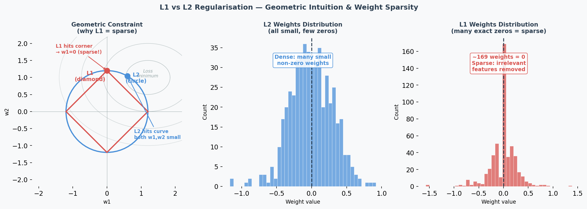
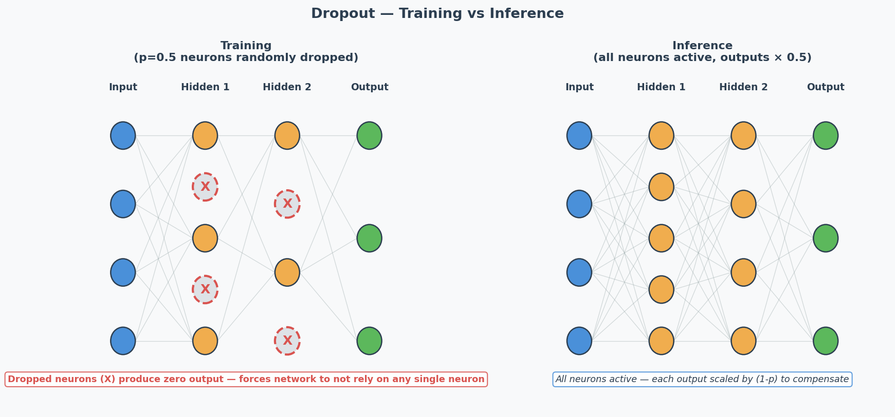
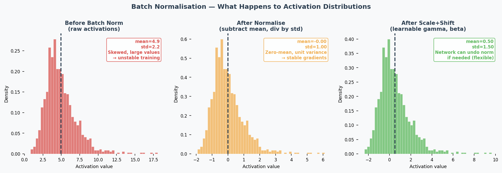

# Regularisation & Batch Normalisation

## Exam Importance
**HIGH** | Tested directly (Practice Q5) and indirectly in every Design Choices question

---

## Feynman Draft

Imagine you're studying for an exam. **Overfitting（过拟合）** is like memorising the textbook word-for-word — you ace the practice test but fail the real exam because you memorised answers instead of understanding concepts.

**Regularisation**（正则化） is like a study technique that forces you to actually understand: someone randomly covers parts of your notes (**Dropout（随机失活）**), or penalises you for writing overly complicated answers (L1/L2).

### L1 and L2 Regularisation

Think of weights as "how much attention" the model pays to each feature.

- **L2 (Ridge / 岭回归)**: Adds penalty proportional to weight² → pushes ALL weights to be small but non-zero — this is called **weight decay（权重衰减）**. Like telling someone "you can use all ingredients, but use them sparingly."
  
  $$L_{total} = L_{original} + \lambda \sum w_i^2$$

- **L1 (Lasso)**: Adds penalty proportional to |weight| → pushes some weights to exactly 0. Like telling someone "pick only the most important ingredients and ignore the rest." Creates **sparse（稀疏）** models — performing automatic **feature selection（特征选择）**.

  $$L_{total} = L_{original} + \lambda \sum |w_i|$$

### Dropout

During training, randomly "turn off" neurons with probability $p$ (typically 0.5). Forces the network to learn redundant representations — no single neuron can be relied on.

**Key:** Dropout is ONLY active during training. During inference, all neurons are used (but outputs are scaled by 1-p to compensate).

### Batch Normalisation（批量归一化） (Practice Q5 — 5 marks)

**What:** Normalise（归一化） the inputs to each layer by subtracting mean and dividing by std of the current mini-batch（小批量）.

$$\hat{x} = \frac{x - \mu_{batch}}{\sqrt{\sigma^2_{batch} + \epsilon}}$$

Then apply learnable scale ($\gamma$) and shift ($\beta$): $y = \gamma \hat{x} + \beta$

**4 Effects (know at least 2 for the exam):**

| Effect | Explanation |
|--------|-------------|
| **Speeds up training（加速训练）** | Keeps activations（激活值） in a good range → gradients stay healthy → can use larger learning rates |
| **Reduces vanishing/exploding gradients（减少梯度消失/爆炸）** | Normalisation prevents activations from becoming extremely small or large |
| **Regularisation effect（正则化效果）** | Mini-batch statistics add noise to activations → acts like implicit regularisation → reduces overfitting |
| **Reduces sensitivity to weight initialisation（降低对权重初始化的敏感性）** | Bad initial weights would create extreme activations → batch norm corrects this automatically |

> Common Misconception: "Batch norm is just standardisation." No — it also has learnable parameters ($\gamma$, $\beta$) that let the network undo the normalisation if that's beneficial. And the normalisation per mini-batch introduces noise that has a regularising effect.

> Core Intuition: Regularisation = purposely limiting model complexity to prevent memorisation and force generalisation.

---

## When to Use What (Design Choices Context)

| Technique | Fights | Don't Use When |
|-----------|--------|---------------|
| L2 regularisation | Overfitting | Underfitting |
| L1 regularisation | Overfitting | Underfitting |
| Dropout | Overfitting | Underfitting |
| Batch normalisation | Various (speeds training, mild regularisation) | — (almost always helps) |
| Early stopping | Overfitting | Underfitting |
| Data augmentation | Overfitting | — |

### Early Stopping（提前停止）

**What:** Monitor validation loss during training. When it stops improving for $N$ consecutive epochs (patience), stop training — even if training loss is still decreasing.

**Why it works:** The point where validation loss starts rising is exactly the point where the model begins memorising training noise. Stopping there gives you the best generalisation.

**In practice:** Save a checkpoint of model weights at each validation improvement. When patience runs out, roll back to the best checkpoint.

### L1 Sparsity（稀疏性） vs L2 Shrinkage（收缩） — Why the Difference?

**Geometric intuition:** L1's constraint region is a diamond (corners touch axes); L2's is a circle. The optimal point is where the loss contour（损失等高线） meets the constraint boundary. The diamond's sharp corners align with axes → weights are pushed to exactly 0. The circle has no corners → weights are pushed toward 0 but never reach it.

**Practical consequence:**
- Use **L1** when you suspect many features are irrelevant (automatic feature selection)
- Use **L2** when all features are somewhat useful (just reduce their magnitudes)
- The **hyperparameter（超参数） λ** controls regularisation strength（正则化强度）: higher λ = stronger penalty. If λ is too high → underfitting（欠拟合） (weights too constrained); too low → minimal regularisation effect.

**Critical exam trap:** If the model is underfitting (train=val=low), adding regularisation makes it WORSE by further constraining the model.

---

## Past Exam Questions

**Practice Q5 [5m]:** Explain 2 effects of batch normalisation (2 marks each: name + explanation).
**2024 Q2:** L2 regularisation as a suggestion for overfitting → YES, explain why.
**Practice Q3:** Dropout as a suggestion for underfitting → NO, explain why.
**2025 Q2b:** Suggest changes for overfitting → regularisation is a valid answer.

---

## 中文思维 → 英文输出

| 你脑中的中文想法 | 考试中应该写的英文 |
|---|---|
| L2让权重变小 | "L2 regularisation penalises large weights, encouraging the model to learn a simpler, more generalisable representation." |
| L1让一些权重变成0 | "L1 regularisation drives some weights to exactly zero, performing automatic feature selection." |
| Dropout让网络不依赖某个神经元 | "Dropout prevents co-adaptation by randomly deactivating neurons, forcing the network to learn distributed representations." |
| Batch norm加速训练 | "Batch normalisation speeds up training by keeping activations in a stable range, allowing higher learning rates." |
| 正则化不能解决欠拟合 | "Regularisation constrains model complexity, which helps with overfitting but worsens underfitting." |
| 正则化强度太大了 | "Excessive regularisation over-constrains the model, leading to underfitting." |
| L1能做特征选择 | "L1 regularisation induces sparsity, effectively performing feature selection by eliminating irrelevant weights." |

### 本章 Chinglish 纠正

| Chinglish (avoid) | Correct English |
|---|---|
| "Dropout can prevent the overfit" | "Dropout helps prevent overfitting" |
| "Batch norm makes training more faster" | "Batch normalisation accelerates training" |
| "The regularisation is too strong so the model is underfit" | "Excessive regularisation over-constrains the model, leading to underfitting" |
| "L1 makes some weight become zero" | "L1 regularisation drives certain weights to exactly zero" |
| "Batch norm is just standardisation" | "Batch normalisation normalises activations per mini-batch, with learnable parameters and an implicit regularisation effect" |
| "Early stopping is stop early" | "Early stopping halts training when validation performance stops improving" |

---

## Whiteboard Self-Test
- [ ] Can you explain L2 regularisation in one sentence?
- [ ] Can you explain why dropout doesn't help underfitting?
- [ ] Can you list 4 effects of batch normalisation?
- [ ] Can you explain the regularisation effect of batch norm (why mini-batch noise helps)?
