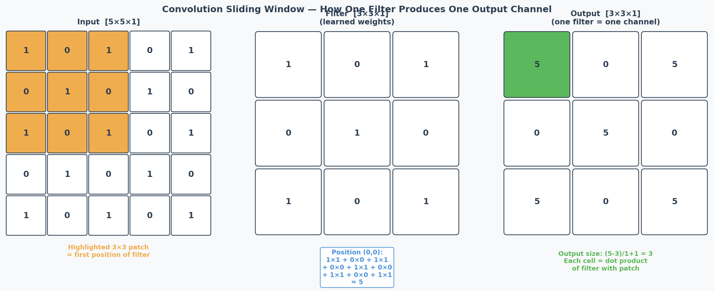
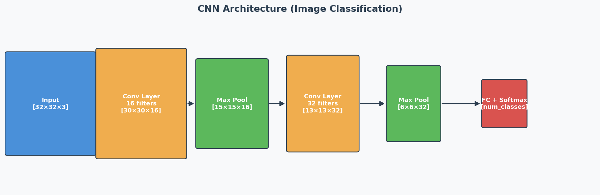
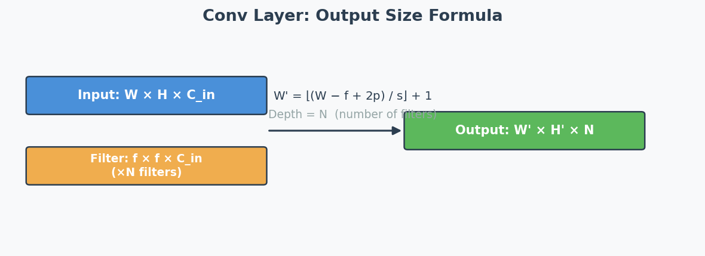

# CNN — Convolutional Neural Networks

## Exam Importance
**MUST** | Every exam has a CNN calculation question (2025 Q6, 2024 Q6, Practice Q7)

---

## Feynman Draft

Imagine you're looking at a photo and trying to find a cat. You don't examine every pixel individually — your eyes scan small regions looking for patterns: edges, then curves, then ears, then a face. A CNN works exactly like this.

A **CNN**（卷积神经网络） slides small "windows" (**filters/kernels**（卷积核/滤波器）) across the image. Each **filter** detects a specific pattern:
- **Layer 1 filters:** detect simple edges (horizontal, vertical, diagonal)
- **Layer 2 filters:** combine edges into shapes (corners, curves)
- **Layer 3+ filters:** combine shapes into objects (ears, eyes, faces)

After sliding filters, we **shrink** the image with **pooling**（池化） (like zooming out) to focus on "where" a pattern exists rather than its exact pixel position.

**Toy Example: A 5x5 image with a 3x3 filter（特征图 = feature map）**



> Common Misconception: "More filters = bigger output feature map." NO — more filters increases the DEPTH (channels), not the spatial dimensions. Spatial size depends on kernel size, stride, and padding.

> Core Intuition: CNN = sliding pattern detector. Shallow layers find edges, deep layers find objects.

---

## Architecture Overview





---

## The Two Formulas You MUST Memorize

### Formula 1: Convolution Output Size
$$\text{output} = \left\lfloor \frac{n + 2p - f}{s} \right\rfloor + 1$$

Where:
- $n$ = input spatial dimension (height or width)
- $p$ = **padding**（填充） (valid = 0, same = computed so output = input)
- $f$ = filter/kernel size
- $s$ = **stride**（步幅）

**Output depth** = number of filters $n'_C$

### Formula 2: Pooling Output Size
$$\text{output} = \left\lfloor \frac{n - f}{s} \right\rfloor + 1$$

Where:
- $n$ = input spatial dimension
- $f$ = pool kernel size
- $s$ = stride (usually = f)

**Output depth** = same as input depth (pooling doesn't change channels!)

**Key difference:** Pooling has NO padding (p=0 always).

---

## Padding Types

| Type | Meaning | Formula Effect |
|------|---------|----------------|
| **Valid padding**（无填充） | No padding, p = 0 | Output shrinks |
| **Same padding**（等尺寸填充） | Pad so output spatial size = input spatial size | $p = (f-1)/2$ when $s=1$ |

**Same padding shortcut:** When stride = 1 and same padding → output spatial dimensions = input spatial dimensions. Just change the depth to the number of filters.

---

## Worked Example: 2025 Q6 (The Exact Exam Question)

**Architecture:**
- Input: [35, 35, 3]
- Conv1: 10 filters, kernel=7, stride=2, **valid** padding
- MaxPool1: kernel=2, stride=2
- Conv2: 20 filters, kernel=3, stride=1, **same** padding
- MaxPool2: kernel=2, stride=2
- FC layer: ? inputs, 10 outputs

**Step-by-step:**

```
Layer: Conv1 (valid, p=0)
  Input:  [35, 35, 3]
  Calc:   (35 + 2*0 - 7) / 2 + 1 = 28/2 + 1 = 14 + 1 = 15
  Output: [15, 15, 10]    ← 10 from number of filters

Layer: MaxPool1
  Input:  [15, 15, 10]
  Calc:   (15 - 2) / 2 + 1 = 13/2 + 1 = 6.5 + 1 = 7.5 → floor = 7
  Output: [7, 7, 10]      ← depth unchanged

Layer: Conv2 (same padding, stride=1)
  Input:  [7, 7, 10]
  Calc:   same padding + stride 1 → spatial stays same
  Output: [7, 7, 20]      ← 20 from number of filters

Layer: MaxPool2
  Input:  [7, 7, 20]
  Calc:   (7 - 2) / 2 + 1 = 5/2 + 1 = 2.5 + 1 = 3.5 → floor = 3
  Output: [3, 3, 20]      ← depth unchanged

Flatten（展平）: 3 × 3 × 20 = 180

Answer: (ii) 180 ✓
```

---

## Worked Example: 2024 Q6

**1) Conv:** Input [50,50,5], ten 5×5×5 filters, stride=3, padding=0
```
(50 + 2*0 - 5) / 3 + 1 = 45/3 + 1 = 15 + 1 = 16
Output: [16, 16, 10]
```

**2) AvgPool:** Input [50,50,5], 5×5 filter, stride=5
```
(50 - 5) / 5 + 1 = 45/5 + 1 = 9 + 1 = 10
Output: [10, 10, 5]   ← depth stays 5!
```

**3) MaxPool:** Same answer as AvgPool! Max vs average only changes VALUES, not dimensions.

---

## Worked Example: Practice Q7

**Given:** Input [21,21,3] → Conv (no padding, s=2) → Output [9,9,100]

Find: n'C, f, nC

- **n'C = 100** (depth of output = number of filters)
- **f:** (21 + 0 - f)/2 + 1 = 9 → (21 - f)/2 = 8 → 21 - f = 16 → **f = 5**
- **nC = 3** (depth of input = filter width/depth)

**Edge detection question:** Early layers (close to input) detect edges because they see small local regions (**receptive field**（感受野）). Deeper layers combine these into complex features (shapes → objects).

---

## Key Facts to Remember

| Fact | Detail |
|------|--------|
| Conv changes depth | Output depth = number of filters |
| Pooling preserves depth | Output depth = input depth |
| Max vs Avg pooling | Same output SIZE, different values |
| Valid padding | p = 0, output shrinks |
| Same padding (s=1) | Output spatial size = input spatial size |
| Floor function | When division isn't exact, round DOWN |
| Filter depth | Must match input depth (filter is 3D: f × f × input_channels) |

---

## 中文思维 → 英文输出

| 中文思路 | 考试英文表达 |
|---------|-------------|
| 先写公式再代入数字 | "Using the formula: output = floor((n + 2p - f) / s) + 1, substituting n=35, p=0, f=7, s=2: (35-7)/2 + 1 = 15." |
| 池化不改变深度 | "Pooling reduces the spatial dimensions while preserving the depth (number of channels)." |
| 最大池化和平均池化输出尺寸一样 | "Max pooling and average pooling produce outputs with the same dimensions; only the values differ." |
| Same padding时空间尺寸不变 | "With same padding and stride 1, the output spatial dimensions match the input." |
| 输出深度等于滤波器数量 | "The depth of the output equals the number of filters applied." |

### 本章 Chinglish 纠正

| Chinglish (避免) | 正确表达 |
|-----------------|---------|
| "The output size is 15 times 15 times 10" | "The output dimensions are [15, 15, 10]" |
| "Pooling will change the channel" | "Pooling does not change the number of channels — only spatial dimensions are reduced" |
| "The filter number decides the deep" | "The number of filters determines the output depth (channels)" |

---

## Whiteboard Self-Test
- [ ] Can you write both formulas from memory?
- [ ] Can you compute: Input [28,28,1] → Conv(16 filters, k=5, s=1, valid) → ?
- [ ] Can you compute: [24,24,16] → MaxPool(k=2, s=2) → ?
- [ ] What's the difference between valid and same padding?
- [ ] Why does max pooling not change the depth?
- [ ] Which layers detect edges? Why?
