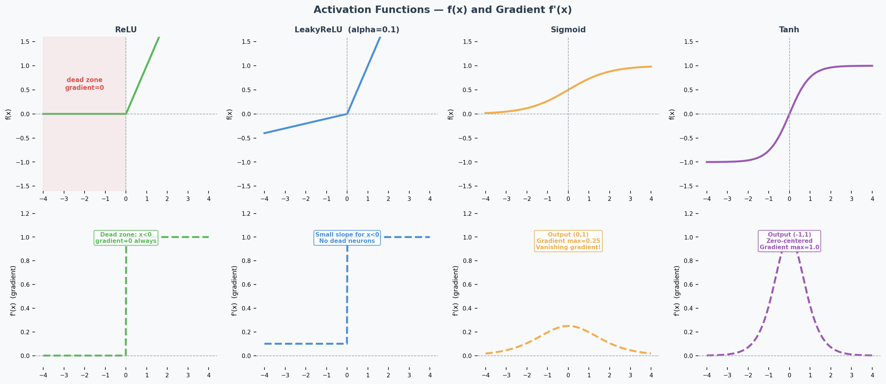
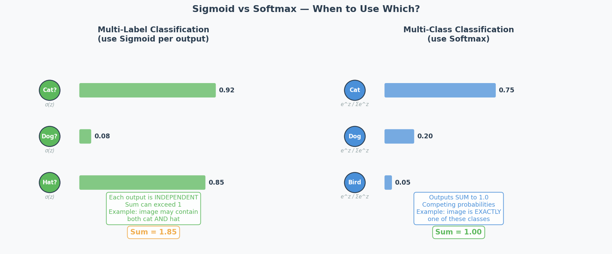
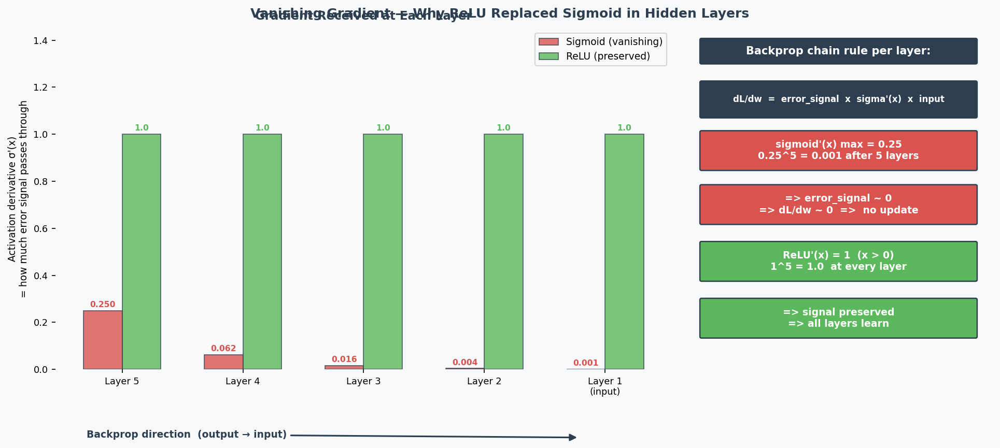
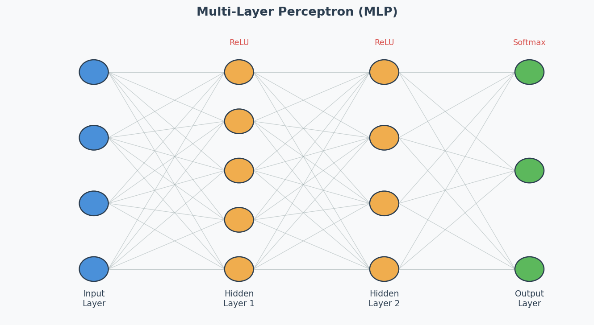

# MLP, Activation Functions & DNN Training

## Exam Importance
**MED** | 2025 Q3 (activation functions), 2024 Q7 (DNN training challenges)

---

## Feynman Draft: Neural Networks

Imagine a team of workers in a factory assembly line. Each worker receives inputs, does a simple calculation (multiply by a weight, add a bias), and passes the result through a "decision gate" (**activation function**（激活函数）) to the next worker.

One worker can only draw a straight line to separate things. But stack many workers in layers, and they can draw incredibly complex boundaries — that's a **Deep Neural Network (DNN)**（深度神经网络）.

---

## Activation Functions (2025 Q3)

### ReLU and the Dying ReLU Problem

**ReLU** (Rectified Linear Unit): $f(x) = \max(0, x)$

**The problem:** If a neuron's input is always negative, ReLU outputs 0 and its gradient is also 0. The neuron stops learning permanently — this is the **Dying ReLU Problem**（神经元死亡问题）. Look at the gradient plot above: the flat zero region on the left is the dead zone.

### LeakyReLU (The Fix)

$$\text{LeakyReLU}(x) = \begin{cases} x & \text{if } x > 0 \\ \alpha x & \text{if } x \leq 0 \end{cases}$$

**How it helps:** The small slope $\alpha$ (typically 0.01–0.1) means the gradient is never zero — dead neurons can recover.

---

## Output Activation（输出激活函数）: Sigmoid vs Softmax (2025 Q3b)

| Scenario | Activation | Why |
|----------|-----------|-----|
| **Multi-class**（多分类） (exactly 1 label) | **Softmax** | Outputs sum to 1 → probability distribution over classes |
| **Multi-label**（多标签） (multiple labels possible) | **Sigmoid** | Each output independently between 0 and 1 |
| **Binary classification** | **Sigmoid** (1 output) or **Softmax** (2 outputs) | Both work |
| **Regression** | **Linear** (none) | Unbounded continuous output |

**2025 Q3b scenario:** Manufacturing quality control — single image may contain multiple anomaly types simultaneously. This is **multi-label** → use **sigmoid**, because each anomaly is predicted independently.

> Common Misconception: "Always use softmax for classification." Only when it's MULTI-CLASS (one label). For multi-label, softmax is wrong because it forces outputs to sum to 1 — detecting one anomaly would lower the probability of detecting others.

---

## Why Deep Networks Are Hard to Train (2024 Q7)

### The Problems:

1. **Vanishing Gradients（梯度消失）:** During **backpropagation**（反向传播）, gradients are multiplied through many layers via the chain rule. With sigmoid activation, the maximum derivative is only 0.25 — so gradients are multiplied by ≤0.25 at each layer. After 6 layers: $0.25^6 ≈ 0.0002$ — the gradient reaching early layers is nearly 0, so they can't learn. **ReLU fixes this** because its derivative is exactly 1 for positive inputs, preserving gradient magnitude perfectly.

2. **Exploding Gradients（梯度爆炸）:** Same multiplication, but with values > 1 → gradient grows exponentially → training becomes unstable.

3. **Overfitting**（过拟合）**:** More parameters = more capacity to memorise training data noise.

4. **Longer training time:** More computations per forward/backward pass.

### The Solutions (name 2 for the exam):

| Solution | How It Helps |
|----------|-------------|
| **Batch normalisation**（批归一化） | Keeps activations in healthy range → gradients don't vanish/explode |
| **Skip connections**（跳跃连接） **(ResNet)** | Gradient flows directly through shortcut → bypasses vanishing gradient problem |
| **LSTM/GRU** (for sequences) | Gating mechanisms control information flow → mitigate vanishing gradients |
| **Better optimisers (Adam)** | Adaptive learning rates per parameter → more stable training |
| **Proper weight initialisation** (He, Xavier) | Prevents activations from starting too large or small |
| **Gradient clipping**（梯度裁剪） | Caps gradient magnitude → prevents explosion |

---

## Weight Initialisation（权重初始化）: Why Zero = Bad (Practice Q3)

If all weights are 0, then:
1. All neurons compute the same output (0)
2. All gradients are the same
3. All weights update by the same amount
4. All neurons remain identical forever → **symmetry problem**（对称性问题）

The network is essentially a single neuron repeated N times. It can't learn different features.

**Correct initialisation:** Random values, properly scaled:
- **Xavier/Glorot:** For sigmoid/tanh: $\text{Var}(w) = 1/n_{in}$
- **He:** For ReLU: $\text{Var}(w) = 2/n_{in}$

**Why two different methods?** Each is designed to keep the variance of activations stable across layers for a specific activation function:
- **Xavier** assumes the activation is roughly linear around 0 (true for sigmoid/tanh near their centre). It balances forward and backward signal variance.
- **He** accounts for the fact that ReLU kills half the inputs (outputs 0 for negative), so it doubles the variance to compensate. Using Xavier with ReLU → activations shrink to 0 in deep networks. Using He with sigmoid → activations may saturate.

**Rule of thumb:** Match initialisation to activation — He for ReLU/LeakyReLU, Xavier for sigmoid/tanh.

---

## Architecture Diagram

---

## 中文思维 → 英文输出

| 中文思路 | 考试英文表达 |
|---------|-------------|
| ReLU的梯度在负数时是0，神经元就死了 | "When inputs are consistently negative, ReLU outputs zero with a zero gradient, causing the neuron to stop learning permanently — this is the dying ReLU problem." |
| LeakyReLU给负数一个小斜率来修复 | "LeakyReLU introduces a small positive slope for negative inputs, ensuring the gradient is never zero and allowing dead neurons to recover." |
| 多标签用sigmoid，多分类用softmax | "For multi-label classification, sigmoid is appropriate because each output is independent. Softmax is unsuitable as it forces outputs to sum to 1." |
| 深度网络难训练因为梯度消失 | "Deep networks are difficult to train because gradients are multiplied through many layers via the chain rule, causing them to vanish exponentially." |
| 权重全初始化为0有对称性问题 | "Zero initialisation creates a symmetry problem — all neurons compute identical outputs and receive identical gradients, making them unable to learn different features." |

### 本章 Chinglish 纠正

| Chinglish (避免) | 正确表达 |
|-----------------|---------|
| "The neuron is dead" | "The neuron has become inactive due to the dying ReLU problem" |
| "Softmax is for classification" | "Softmax is for multi-class classification; sigmoid is for multi-label" |
| "Deep network is hard to train" | "Deep networks present training challenges, particularly vanishing gradients" |

---

## Whiteboard Self-Test
- [ ] Can you explain the dying ReLU problem and how LeakyReLU fixes it?
- [ ] When do you use sigmoid vs softmax for the output layer?
- [ ] Can you name 2 reasons why deep networks are hard to train?
- [ ] Can you name 2 solutions that make deep training easier?
- [ ] Why is initialising weights to 0 a bad idea?
