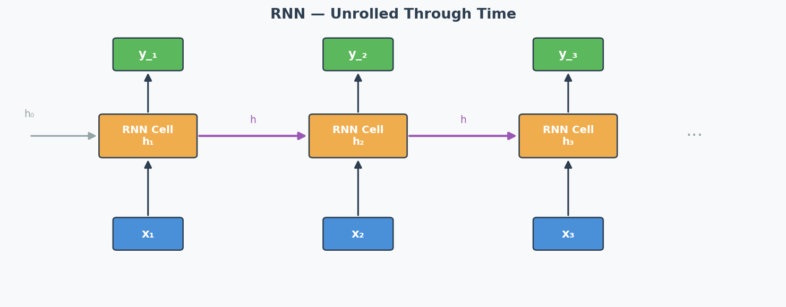
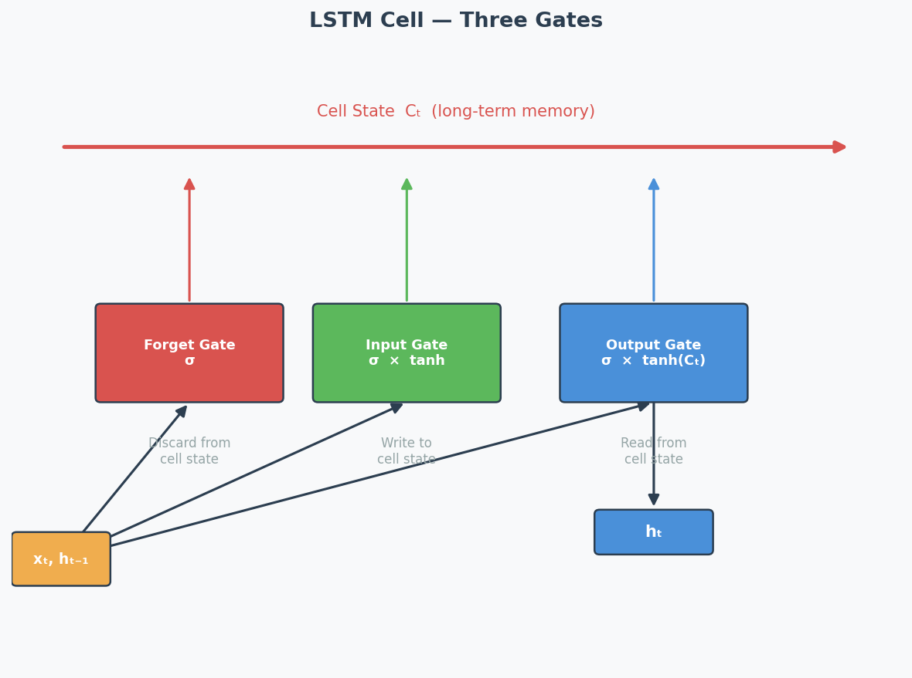

# RNN / LSTM / GRU — Recurrent Neural Networks

## Exam Importance
**MED** | Tested in 2024 Q5 (alongside Transformer comparison) — 4 marks

---

## Feynman Draft

Imagine you're watching a movie and trying to understand the plot. You don't forget everything after each scene — you carry a **running memory** of what happened before. When a character says "he went back to the castle," you remember who "he" is and which castle from earlier scenes.

That's exactly what an **RNN (Recurrent Neural Network)**（循环神经网络） does. It processes a sequence (words, time steps, video frames) one element at a time, and passes a **hidden state**（隐藏状态） from one step to the next — like your running memory of the movie.

```
Input:    x₁        x₂        x₃        x₄
           ↓          ↓          ↓          ↓
State:  → [h₁] →→ [h₂] →→ [h₃] →→ [h₄] → output
           
Each box takes BOTH the current input AND the previous hidden state.
h₂ = f(W·h₁ + U·x₂ + b)
```

**The Sequential Processing Trade-off (The Exact Exam Question — 2024 Q5):**

**Advantage:** Because the RNN uses **sequential processing**（顺序处理）, processing one step at a time, it **naturally captures the order** of the sequence. You don't need to tell it "this word comes first, that word comes second" — it inherently knows because it processes them in order. The sequential structure IS the ordering mechanism.

**Drawback:** Because each step MUST wait for the previous step's hidden state to finish, you **cannot parallelise**（并行化） the computation. For a sequence of length 1000, you need 1000 sequential operations. This makes training **very slow for long sequences**.

Additionally, the hidden state must carry ALL information from the past through a single vector — for very long sequences, early information gets "washed out." This is related to the **vanishing gradient problem**（梯度消失问题）.

---

## Why Vanilla RNNs Struggle with Long Sequences

During **backpropagation through time (BPTT)**（时间反向传播）, gradients are multiplied by the recurrent weight matrix at each time step:

$$\frac{\partial h_t}{\partial h_1} = \prod_{i=1}^{t-1} \frac{\partial h_{i+1}}{\partial h_i}$$

If these partial derivatives are < 1 → gradients **vanish** (early parts of the sequence get no learning signal)
If they are > 1 → gradients **explode** (training becomes unstable)

**Practical impact:** A vanilla RNN trained on a 100-word sentence might "forget" what happened in the first few words by the time it reaches the end.

---

## LSTM — Long Short-Term Memory

LSTM solves the vanishing gradient problem by adding **gating mechanisms**（门控机制） that control information flow:

```
┌──────────── Cell State (highway of information) ──────────────┐
│                                                                │
│    ┌─────┐      ┌─────┐      ┌─────┐                         │
│    │Forget│      │Input │      │Output│                        │
│    │ Gate │      │ Gate │      │ Gate │                        │
│    └──┬──┘      └──┬──┘      └──┬──┘                         │
│       │            │            │                              │
└───────┴────────────┴────────────┴──────────────────────────────┘
```

| Gate | What It Does | Analogy |
|------|-------------|---------|
| **Forget Gate**（遗忘门） | Decides what old information to discard | "Should I forget the first scene?" |
| **Input Gate**（输入门） | Decides what new information to store | "Is this new scene important?" |
| **Output Gate**（输出门） | Decides what to output from the cell state | "What part of my memory is relevant now?" |

The **cell state**（细胞状态） acts like a conveyor belt — information can flow through unchanged if the gates allow it. This creates a direct path for gradients to flow back through time without being multiplied at each step → **solves vanishing gradients**.

---

## GRU — Gated Recurrent Unit

GRU is a simplified version of LSTM with only 2 gates:

| Gate | What It Does |
|------|-------------|
| **Reset Gate**（重置门） | Controls how much past information to forget (similar to forget gate) |
| **Update Gate**（更新门） | Controls the balance between old state and new candidate (combines forget + input) |

**GRU vs LSTM:** GRU has fewer parameters → faster to train, sometimes performs just as well. LSTM is more expressive for complex long-range dependencies.

---

## How Transformers Fix the RNN Problem (2024 Q5.2)

| Problem | RNN Approach | Transformer Solution |
|---------|-------------|---------------------|
| Sequence order | Implicit (process sequentially) | Explicit via **positional encoding** |
| Parallelisation | NOT possible (sequential dependency) | FULLY parallel (all positions at once) |
| Long-range dependencies | Difficult (vanishing gradients) | Direct connections via **self-attention** |
| Speed | Slow for long sequences | Fast (O(1) sequential operations, O(n²) total) |

**The key answer for 2024 Q5.2:**
1. The Transformer processes ALL input positions simultaneously using **embeddings** (not sequentially) → enables parallel computation → much faster
2. But this loses order information → solved by adding **positional encoding** to the embeddings
3. Self-attention creates direct connections between any two positions → no vanishing gradient over distance

---

## Exam Answer Template for 2024 Q5

**(1) Why is sequential processing both an advantage and drawback?**

"Sequential processing is an advantage because it naturally captures the order of the input sequence — each hidden state implicitly encodes position information based on the processing order. However, it is also a drawback because each step depends on the previous hidden state, making it impossible to parallelise computation. For long sequences, this leads to very slow training and inference times."

**(2) How does the Transformer alleviate this?**

"The Transformer architecture processes all input positions in parallel by creating embeddings for each token simultaneously, rather than processing them sequentially. This dramatically speeds up computation. However, since parallel processing loses positional information, the Transformer adds positional encoding to the embeddings to integrate information about the sequence order."

---

## Architecture Diagrams

**RNN Unrolled Through Time:**



**LSTM Cell — Three Gates:**



---

## 中文思维 → 英文输出

| 中文思路 | 考试英文表达 |
|---------|-------------|
| RNN按顺序处理是优点也是缺点 | "Sequential processing is both an advantage and a drawback: it naturally captures temporal order, but prevents parallelisation." |
| LSTM用门控解决梯度消失 | "LSTM mitigates vanishing gradients by introducing gating mechanisms that control information flow through a dedicated cell state." |
| Transformer用位置编码补回顺序信息 | "The Transformer compensates for the loss of order information by adding positional encoding to embeddings." |
| GRU比LSTM简单，参数少 | "GRU simplifies LSTM by combining the forget and input gates into a single update gate, reducing the number of parameters." |
| RNN不能并行所以慢 | "Sequential processing prevents parallelisation, making RNN training slow for long sequences." |

### 本章 Chinglish 纠正

| Chinglish (避免) | 正确表达 |
|-----------------|---------|
| "RNN can remember the before information" | "RNNs maintain a hidden state that carries information from previous time steps" |
| "LSTM has three gates to control the memory" | "LSTM uses three gates (forget, input, output) to regulate information flow through the cell state" |
| "Transformer is better than RNN in all ways" | "Transformers excel in most scenarios, but RNNs may be preferred for resource-constrained or streaming applications" |

---

## Whiteboard Self-Test
- [ ] Can you draw the basic RNN unrolled diagram (input → hidden state → next step)?
- [ ] Can you explain sequential processing as BOTH advantage and drawback?
- [ ] Can you name the 3 gates in LSTM and what each does?
- [ ] Can you explain how the Transformer solves the parallelisation problem?
- [ ] Why do vanilla RNNs have trouble with long sequences?
