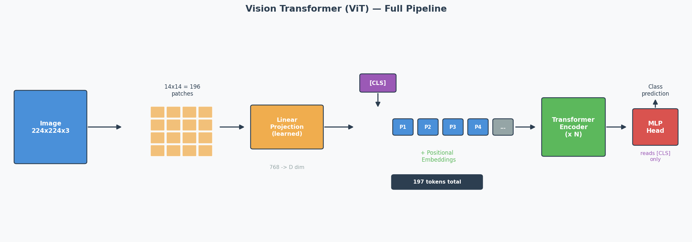
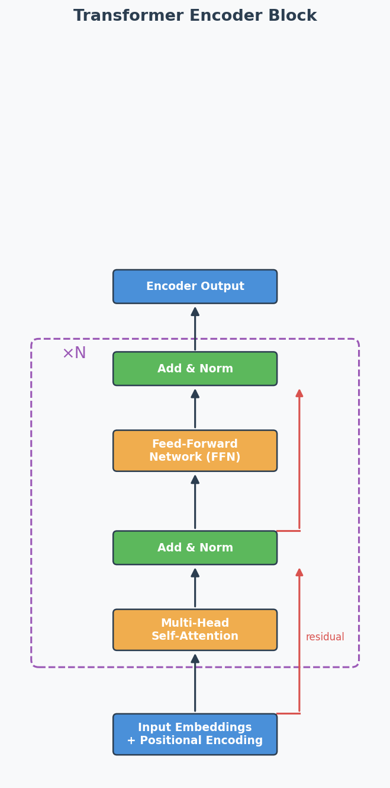
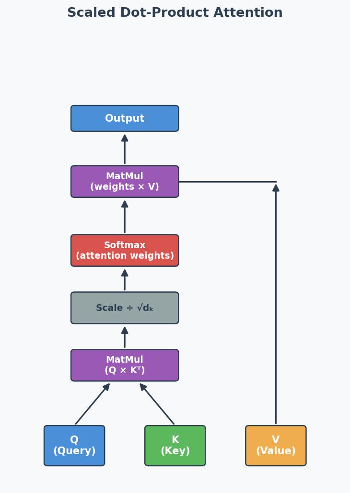

# Transformer & Attention Mechanism

## Exam Importance
**MUST** | Every exam has a Transformer question (2025 Q5, 2024 Q5, Practice Q6)

---

## Feynman Draft

Imagine you're reading a long book and someone asks: "What did the main character feel about the letter?"

You don't re-read every word. You **skim for relevant parts** — you pay more attention to sentences about the character and the letter, and less attention to descriptions of the weather. That's **Attention**（注意力机制）.

Now imagine you have 8 friends, and each one reads the book looking for something different: one tracks emotions, one tracks characters, one tracks locations, one tracks time. Then they share notes. That's **Multi-Head Attention**（多头注意力）— multiple "perspectives" on the same input.

**The Transformer's Big Idea:**

RNNs read words one by one (like reading a book left to right, can't skip ahead). This is slow. The Transformer reads ALL words at once (like seeing the whole page), then uses Attention to figure out which words relate to which. Much faster.

But wait — if you see all words at once, you lose the order! "Dog bites man" ≠ "Man bites dog". Solution: add **Positional Encoding**（位置编码）— a signal that tells the model "this word is in position 1, this one is position 2..."

**Toy Example: "The cat sat on the mat"**

With attention, when processing "sat", the model assigns weights:
```
"The"  → 0.05  (not very relevant)
"cat"  → 0.60  (WHO sat? very relevant!)
"sat"  → 0.10  (itself)
"on"   → 0.05  (grammar word)
"the"  → 0.05  (not very relevant)
"mat"  → 0.15  (WHERE sat? somewhat relevant)
```

> Common Misconception: "Transformers are just faster RNNs." No — they work fundamentally differently. RNNs process sequentially (maintaining hidden state). Transformers process all positions in parallel (using attention to find relationships).

> Core Intuition: Attention = learned "relevance weighting" between all pairs of inputs, processed in parallel.

---

## Formal Definition: Scaled Dot-Product Attention

**Scaled Dot-Product Attention**（缩放点积注意力）:

$$\text{Attention}(Q, K, V) = \text{softmax}\left(\frac{QK^T}{\sqrt{d_k}}\right) V$$

Where:
- **Q** (Query): "What am I looking for?"
- **K** (Key): "What do I contain?"
- **V** (Value): "What information do I provide?"
- $d_k$: dimension of keys (scaling factor to prevent huge dot products)

The softmax creates attention **weights** (sum to 1) → multiply by V to get weighted combination.

---

## Multi-Head Attention (考试高频)

Instead of one attention function, run **h** attention heads in parallel, each with its own learned Q, K, V weight matrices:

$$\text{MultiHead}(Q, K, V) = \text{Concat}(\text{head}_1, ..., \text{head}_h) W^O$$

**Why multiple heads?**
- Each head learns to focus on **different aspects** (syntax, semantics, position)
- Single head would have an **averaging effect** — blurs different types of relationships
- Multiple heads capture richer, more diverse patterns

---

## Masked Attention in Decoder (2025 Q5a, 2024 Q5a)

**What:** In the decoder, when predicting token at position $t$, the attention is **masked** to prevent looking at positions $t+1, t+2, ...$

**Why:** During training, all tokens are available (**teacher forcing**（教师强迫）), but the model must learn to predict WITHOUT seeing the future. The mask sets future positions to $-\infty$ before softmax → attention weights become 0 for future tokens.

**In plain English:** It's like covering the right half of the answer sheet during an exam — you can only see what you've already written, not what comes next. This preserves the **autoregressive**（自回归） **property**: each prediction depends only on previous predictions.

```
Without mask:        With mask:
"I love cats"       "I love cats"
 ↕  ↕  ↕             →  →  →    (can only look LEFT)
All attend to all   Each token only attends to previous tokens
```

---

## Vision Transformer (ViT) — Full Pipeline (2025 Q5b)

### The Core Idea

CNNs use sliding filters to process images. ViT asks: **what if we just cut the image into patches**（图像块） **and feed them into a standard Transformer?** It turns out this works — and for large datasets, ViT matches or beats CNNs.



### The ViT Pipeline (Step by Step)

**Concrete Example: 224 × 224 image, patch size = 16 × 16**

```
Step 1: Split into patches
   224 / 16 = 14 patches per side → 14 × 14 = 196 patches total
   Each patch is 16 × 16 × 3 (RGB) = 768 values

Step 2: Linear projection (patch embedding)
   Each patch (768 values) → linearly projected to a D-dimensional vector
   This is NOT just flattening — it's a learned linear layer
   Output: 196 vectors of dimension D

Step 3: Prepend [CLS] token
   Add one learnable vector at position 0
   Sequence is now: [CLS], patch_1, patch_2, ..., patch_196
   Total: 197 tokens

Step 4: Add positional embeddings
   Each of the 197 positions gets a learnable positional embedding (added, not concatenated)
   Without this: the model can't distinguish top-left patch from bottom-right

Step 5: Pass through Transformer encoder
   Standard encoder: Multi-Head Self-Attention → Add & Norm → FFN → Add & Norm
   Repeated N times (ViT-Base uses N=12)

   "Add & Norm" explained:
   - ADD = residual/skip connection: output = sublayer(x) + x
     Why: gradient flows directly through the '+' → prevents vanishing gradients in deep models
   - NORM = Layer Normalisation: normalise across features for each token
     Why: keeps activations stable → faster, more stable training

Step 6: Classification
   Take ONLY the [CLS] token's output → pass through MLP head → class prediction
```

### Why Patches Instead of Pixels?

Self-attention complexity is **O(n²)** where n = number of tokens.

| Approach | n (tokens) | Attention operations |
|----------|------------|---------------------|
| Pixel-level (224×224) | 50,176 | ~2.5 billion — impossible |
| Patch-level (16×16 patches) | 196 | ~38,000 — feasible |

Patches reduce the sequence length by a factor of 256, making attention computationally tractable.

### The [CLS] Token — What and Why

**What:** A special **learnable** embedding prepended to the patch sequence. It has no image content initially — it starts as random values and is learned during training.

**How it works:** Through self-attention across all encoder layers, the [CLS] token gradually **aggregates information from ALL patches** into a single global representation — like a "summary" token.

**Why not just use all patch outputs?**
You could (some variants use **Global Average Pooling** over all patch embeddings instead). But [CLS] is more efficient: the MLP classification head only needs to read **one vector** instead of processing 196 vectors.

### ViT vs CNN — Key Differences (Likely Exam Comparison)

| Aspect | CNN | ViT |
|--------|-----|-----|
| Basic operation | Sliding filters (convolution) | Self-attention over patches |
| **Inductive bias**（归纳偏置） | Strong: locality + translation invariance built in | Weak: no assumptions about spatial structure |
| Small datasets | **Better** — inductive bias compensates for limited data | Worse — needs pre-training on large data |
| Large datasets | Good | **Better** — fewer assumptions → more flexible |
| Computation pattern | Local (each filter sees a small region) | Global (each patch attends to ALL other patches) |
| Long-range dependencies | Only in deep layers (receptive field grows with depth) | From layer 1 (full attention is global) |

> Common Misconception: "ViT is always better than CNN." Wrong — ViT only beats CNN when trained on **large datasets** (e.g., ImageNet-21k, JFT-300M). On small datasets, CNN's inductive bias gives it a significant advantage. This is why ViT models are typically **pre-trained on large data then fine-tuned** on smaller target datasets.

> Core Intuition: ViT trades CNN's built-in assumptions (locality, translation invariance) for the Transformer's flexibility — this pays off only when you have enough data to learn those patterns from scratch.

---

## RNN vs Transformer (2024 Q5)

| Aspect | RNN | Transformer |
|--------|-----|-------------|
| Processing | Sequential (one token at a time) | Parallel (all tokens at once) |
| Order info | Implicit (from sequential processing) | Explicit (positional encoding needed) |
| Speed | Slow for long sequences | Fast (parallelisable) |
| Long-range deps | Struggles (vanishing gradients) | Good (direct attention connections) |
| Advantage | Natural order capture | Parallelisation + long-range attention |
| Drawback | Can't parallelise | Needs positional encoding, O(n²) attention |

**Exam answer structure for 2024 Q5:**
1. **Advantage of sequential:** RNNs naturally capture sequence order through their step-by-step processing — no extra mechanism needed.
2. **Drawback of sequential:** Can't parallelise → slow for long sequences. Each step must wait for the previous one.
3. **How Transformer fixes it:** Uses embeddings to represent all positions at once (parallel), then adds positional encoding to restore order information that would otherwise be lost.

---

## Past Exam Questions Summary

| Exam | Question | What They Asked |
|------|----------|----------------|
| 2025 Q5a | Masked attention in decoder | Why mask? (autoregressive property) |
| 2025 Q5b | ViT [CLS] token | What is it? Why useful? (aggregation + efficiency) |
| 2024 Q5 | RNN advantage/drawback + how Transformer fixes | Sequential processing trade-off |
| Practice Q6a | What is multi-head attention? | Multiple attention heads with separate Q/K/V |
| Practice Q6b | Why is multi-head attention useful? | Different aspects, avoids averaging |

---

## English Expression Templates

**Explaining attention:**
- "The attention mechanism allows the model to focus on the most relevant parts of the input sequence when making predictions."
- "Attention computes a weighted sum of values, where weights reflect the relevance of each input position."

**Explaining masked attention:**
- "Masking prevents each position from attending to future tokens, ensuring predictions depend only on known outputs."
- "This preserves the autoregressive property during training."

**Explaining multi-head:**
- "Multi-head attention runs several attention functions in parallel, each focusing on different aspects of the input."
- "This is beneficial because a single head would have an averaging effect over all types of relationships."

---

## Architecture Diagrams

**Transformer Encoder Block:**



**Scaled Dot-Product Attention:**



---

## 中文思维 → 英文输出

| 中文思路 | 考试英文表达 |
|---------|-------------|
| 注意力就是给每个位置加权 | "The attention mechanism computes a weighted sum of values, where the weights reflect the relevance of each input position to the current query." |
| 多头是为了关注不同方面 | "Multi-head attention runs several attention functions in parallel, each with its own learned projections, allowing the model to focus on different aspects simultaneously." |
| 遮蔽是为了不看未来的token | "Masking prevents each position from attending to future tokens, preserving the autoregressive property during training." |
| CLS token聚合所有patch的信息 | "The [CLS] token aggregates information from all image patches through self-attention, providing a global representation for classification." |
| ViT需要大数据才比CNN好 | "ViT outperforms CNN only when trained on large-scale datasets; on small datasets, CNN's stronger inductive bias is advantageous." |

### 本章 Chinglish 纠正

| Chinglish (避免) | 正确表达 |
|-----------------|---------|
| "Attention can let model focus on important part" | "The attention mechanism enables the model to dynamically focus on the most relevant parts of the input" |
| "Mask is for preventing cheat" | "Masking prevents information leakage from future tokens during training" |
| "ViT is cut picture to small pieces" | "ViT splits the image into non-overlapping patches and processes them as a sequence of tokens" |

---

## Whiteboard Self-Test
- [ ] Can you draw the Transformer encoder block (self-attention → add&norm → FFN → add&norm)?
- [ ] Can you explain Q, K, V in one sentence each?
- [ ] Can you explain masked attention and WHY it's needed?
- [ ] Can you explain the [CLS] token in ViT?
- [ ] Can you explain why multi-head attention is better than single-head?
- [ ] Can you compare RNN vs Transformer in 3 bullet points?
