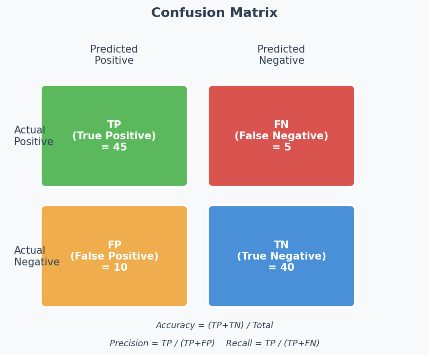

# Evaluation Metrics — Confusion Matrix & Beyond

## Exam Importance
**HIGH** | 2 out of 3 exams (2024 Q3, Practice Q4) — 7 marks total

---

## Feynman Draft

Imagine you're a doctor testing patients for a disease. You have 100 patients. Your test says 25 are sick. But how good is your test really?

The **Confusion Matrix**（混淆矩阵） breaks down exactly what happened:

```
                    Actually Sick    Actually Healthy
Test says "Sick"     TP (True Pos)    FP (False Pos)（假阳性/误报） ← "False alarm"
Test says "Healthy"  FN (False Neg)   TN (True Neg)（真阴性）      ← "Missed case"
                     （真阳性）        （假阴性/漏报）
```

**The 3 key metrics:**

| Metric | Formula | In Doctor Terms | When It Matters |
|--------|---------|----------------|-----------------|
| **Accuracy**（准确率） | (TP+TN) / All | % of ALL patients diagnosed correctly | General performance |
| **Precision**（精确率） | TP / (TP+FP) | Of patients told "sick", how many really are? | When false alarms are costly |
| **Recall**（召回率） | TP / (TP+FN) | Of actually sick patients, how many did we find? | When missing a case is dangerous |

**Toy Example (2024 Q3):**

```
                True Positive    True Negative
Predicted Pos      500              400
Predicted Neg        0              100
```

- **Accuracy** = (500 + 100) / 1000 = **60%**
- **Precision** = 500 / (500 + 400) = 500/900 = **55.6%**
- **Recall** = 500 / (500 + 0) = **100%**

**Interpretation (this is worth marks!):** The model has perfect recall (catches ALL positives) but terrible precision (55.6% of its "positive" predictions are wrong). It achieves this by predicting almost everything as positive — like a doctor who tells every patient they're sick. That's not useful!

> Common Misconception: "High accuracy = good model." WRONG! If 99 out of 100 patients are healthy and your model always says "healthy", accuracy = 99%. But recall = 0% — you missed every sick person. **Always check precision AND recall**, especially with imbalanced classes.

---

## Toy Example 2 (Practice Q4):

```
                True Positive    True Negative
Predicted Pos        5               20
Predicted Neg       10               65
```

- **Accuracy** = (5 + 65) / 100 = **70%**
- **Recall** = 5 / (5 + 10) = 5/15 = **33.3%**

**Interpretation:** Accuracy looks decent (70%), but recall is awful (33%). The model only finds 1 in 3 sick patients. This is because the data is **class imbalanced**（类别不平衡） — 85 negatives vs 15 positives. The model learns to mostly predict "negative" because that's the safe bet for accuracy.

---

## The Class Imbalance Trap (Exam Favourite)

**Pattern the teacher uses:** Give you a confusion matrix where accuracy looks "OK" but precision or recall reveals the model is actually terrible at one class.

**How to spot it:**
1. Calculate all metrics
2. Check if positives and negatives are balanced
3. If one class dominates → accuracy is misleading → look at per-class metrics

**How to answer the "What do you think?" question:**
1. State the numbers (accuracy, precision, recall)
2. **Observe:** "The model is [good/bad] at classifying [positive/negative] examples"
3. **Explain:** "This is because [the model predicts most examples as X / the classes are imbalanced]"
4. **Conclude:** "If we care about [finding positives/avoiding false alarms], this model [does well / performs poorly]"

---

## Quick Reference: All Formulas

$$\text{Accuracy} = \frac{TP + TN}{TP + TN + FP + FN}$$

$$\text{Precision} = \frac{TP}{TP + FP}$$

$$\text{Recall (Sensitivity)} = \frac{TP}{TP + FN}$$

$$\text{F1 Score（F1分数）} = \frac{2 \times \text{Precision} \times \text{Recall}}{\text{Precision} + \text{Recall}}$$

**When to use F1:** When you care about BOTH precision AND recall equally but the classes are imbalanced. F1 is the **harmonic mean**（调和平均数） — it penalises extreme imbalance between precision and recall. A model with precision=100%, recall=1% gets F1≈2%, not 50.5%.

**Example from Mock Exam 2:** Precision=70%, Recall=70% → F1 = 2×0.7×0.7/(0.7+0.7) = **70%**. Equal precision and recall → F1 equals both. But if Precision=90%, Recall=10% → F1 = 2×0.9×0.1/(0.9+0.1) = **18%** — F1 reveals the model is bad despite high precision.

**Memory trick:**
- **Precision** = "of all my **P**ositive predictions, how many were right?" (P for Predicted)
- **Recall** = "of all **R**eal positives, how many did I find?" (R for Real)

---

## English Expression Templates

**Calculating:**
- "The accuracy is (TP+TN)/(TP+TN+FP+FN) = ..."

**Interpreting:**
- "The model achieves high recall but low precision, indicating it predicts most instances as positive."
- "Despite the seemingly acceptable accuracy of 70%, the model performs poorly at identifying positive instances, with a recall of only 33%."
- "This discrepancy is due to class imbalance in the dataset."

---

## Confusion Matrix Diagram



---

## 中文思维 → 英文输出

| 中文思路 | 考试英文表达 |
|---------|-------------|
| 准确率高不代表模型好 | "Despite the seemingly high accuracy, the model may be performing poorly — this is common with class-imbalanced datasets." |
| 模型把什么都预测成正类了 | "The model predicts almost everything as positive, achieving high recall but at the cost of many false positives." |
| 类别不平衡导致准确率有误导性 | "The high accuracy is misleading due to class imbalance — the model simply predicts the majority class." |
| recall高但precision低说明误报多 | "High recall with low precision indicates the model catches most positives but generates many false alarms." |
| F1综合了precision和recall | "The F1 score is the harmonic mean of precision and recall, providing a balanced measure when both metrics matter." |

### 本章 Chinglish 纠正

| Chinglish (避免) | 正确表达 |
|-----------------|---------|
| "The accuracy is 70% so the model is OK" | "The accuracy of 70% may be misleading — examining precision and recall reveals the model's true behaviour" |
| "The model can find all the positive" | "The model achieves perfect recall, identifying all positive instances" |
| "Because data is not balance" | "This is due to class imbalance in the dataset" |

---

## Whiteboard Self-Test
- [ ] Can you draw a confusion matrix and label TP, TN, FP, FN?
- [ ] Can you calculate accuracy, precision, and recall from any matrix?
- [ ] Can you explain why 70% accuracy might actually be a bad model?
- [ ] What does recall=100% with precision=56% tell you about the model?
